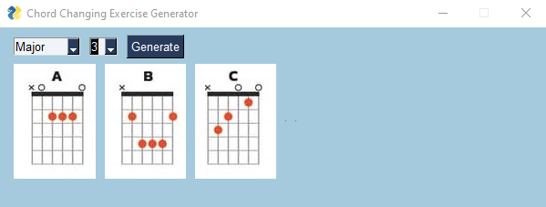

# Guitar Chord Transition Exercise Generator

[](https://opensource.org/licenses/MIT)
<br>


## Overview

Welcome to the Guitar Chord Transition Exercise Generator! This Python program utilizes PySimpleGUI to create exercises for practicing guitar chord transitions. Whether you're a beginner or an experienced guitarist looking to improve your chord-switching skills, this tool is designed to help you enhance your proficiency in a fun and interactive way.

## Features

- Automatically generates random chord transition exercises to keep your practice sessions diverse.
- Focusing on specific chord combinations or chord families.


## Clone the repository:
   ```bash
   git clone https://github.com/ZiyaKolcu/Chord_Changing_Exercise_Generator.git
